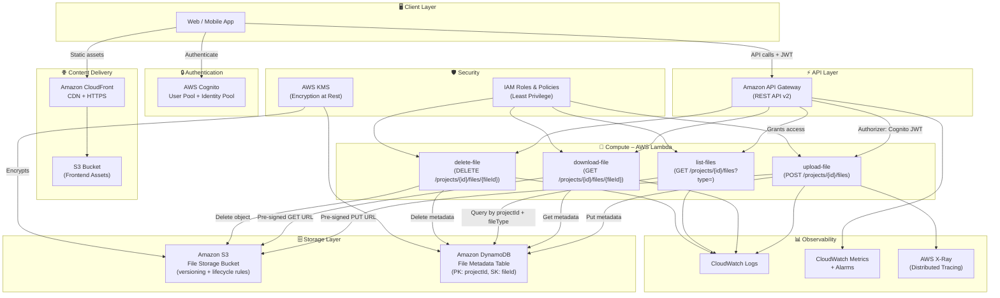

# AWS Serverless Architecture – File Management Service

## Overview

This document describes the AWS serverless architecture for a multi-project file
management service that allows users to upload, list, download, and delete files.

---

## Architecture Diagram



---

## Component Details

### 1. Client Layer
- A web or mobile application that authenticates via **AWS Cognito** and calls the REST API.
- Static assets are served through **CloudFront + S3** for low-latency global delivery.

### 2. Authentication – AWS Cognito
| Feature | Detail |
|---------|--------|
| User Pool | Stores user accounts, handles sign-up / sign-in |
| Identity Pool | Issues temporary AWS credentials for pre-signed URL generation |
| JWT Authorizer | API Gateway validates Cognito JWTs on every request |

### 3. API Layer – Amazon API Gateway (HTTP API v2)
| Route | Method | Lambda |
|-------|--------|--------|
| `/projects/{projectId}/files` | POST | `upload-file` |
| `/projects/{projectId}/files` | GET | `list-files` |
| `/projects/{projectId}/files/{fileId}` | GET | `download-file` |
| `/projects/{projectId}/files/{fileId}` | DELETE | `delete-file` |

All routes require a valid Cognito JWT (`Authorization: Bearer <token>`).

### 4. Compute – AWS Lambda (Node.js 20.x)

#### upload-file
1. Validates `Content-Type` / file extension against an allow-list.
2. Generates a **pre-signed S3 PUT URL** (15-minute TTL).
3. Stores file metadata in DynamoDB (`projectId`, `fileId`, `fileName`, `fileType`, `s3Key`, `uploadedAt`, `uploadedBy`, `size`).
4. Returns the pre-signed URL to the client for direct browser-to-S3 upload.

#### list-files
1. Queries DynamoDB with `projectId` as the partition key.
2. Optionally filters by `fileType` query parameter (e.g., `?type=pdf`).
3. Returns a paginated list of file metadata.

#### download-file
1. Reads metadata from DynamoDB to resolve the S3 key.
2. Generates a **pre-signed S3 GET URL** (15-minute TTL).
3. Returns the URL to the client.

#### delete-file
1. Reads metadata from DynamoDB to resolve the S3 key.
2. Deletes the S3 object.
3. Removes the DynamoDB record.

### 5. Storage Layer

#### Amazon S3 – File Storage
- **Object key pattern:** `{projectId}/{fileType}/{fileId}/{fileName}`
- Versioning enabled to protect against accidental deletion.
- Lifecycle rules: transition objects to **S3 Intelligent-Tiering** after 30 days.
- Server-side encryption with **AWS KMS** (SSE-KMS).
- CORS configured for pre-signed URL browser uploads.
- Block all public access; files only accessible via pre-signed URLs.

#### Amazon DynamoDB – Metadata
| Attribute | Type | Notes |
|-----------|------|-------|
| `projectId` | String | Partition Key |
| `fileId` | String | Sort Key (UUID v4) |
| `fileName` | String | Original file name |
| `fileType` | String | MIME type (e.g., `application/pdf`) |
| `fileExtension` | String | e.g., `pdf`, `png`, `dwg` |
| `s3Key` | String | Full S3 object key |
| `size` | Number | File size in bytes |
| `uploadedAt` | String | ISO 8601 timestamp |
| `uploadedBy` | String | Cognito `sub` (user ID) |

- **GSI:** `fileExtension-uploadedAt-index` – enables efficient queries by file type across a project.
- On-demand billing mode (auto-scales with traffic).
- Point-in-time recovery (PITR) enabled.

### 6. Security
- **IAM least-privilege** roles for each Lambda function.
- **KMS encryption** at rest for S3 and DynamoDB.
- **Pre-signed URLs** ensure files are never publicly exposed; each URL expires after 15 minutes.
- API Gateway enforces **HTTPS only**.
- S3 bucket has **Block Public Access** enabled.

### 7. Observability
- **CloudWatch Logs** for structured Lambda logging (JSON).
- **CloudWatch Alarms** on Lambda error rate, duration, and API Gateway 5xx errors.
- **AWS X-Ray** for distributed tracing across API Gateway and Lambda.

---

## Data Flow – File Upload

```
1. Client authenticates with Cognito → receives JWT
2. Client calls POST /projects/{projectId}/files  (fileName, fileType, size)
3. API Gateway validates JWT → invokes upload-file Lambda
4. Lambda validates file type, generates fileId (UUID)
5. Lambda writes metadata to DynamoDB (status: PENDING)
6. Lambda generates pre-signed S3 PUT URL (15 min TTL)
7. Lambda returns { fileId, uploadUrl }
8. Client uploads file bytes directly to S3 via uploadUrl
9. (Optional) S3 Event Notification triggers a post-process Lambda to mark status: COMPLETE
```

## Data Flow – File Download

```
1. Client calls GET /projects/{projectId}/files/{fileId}
2. API Gateway validates JWT → invokes download-file Lambda
3. Lambda queries DynamoDB for metadata (resolves s3Key)
4. Lambda generates pre-signed S3 GET URL (15 min TTL)
5. Lambda returns { downloadUrl, fileName, fileType }
6. Client downloads file directly from S3 via downloadUrl
```

## Data Flow – List Files by Type

```
1. Client calls GET /projects/{projectId}/files?type=pdf
2. API Gateway validates JWT → invokes list-files Lambda
3. Lambda queries DynamoDB GSI (fileExtension-uploadedAt-index)
   with projectId condition and fileExtension = "pdf"
4. Lambda returns paginated list of file metadata
```
